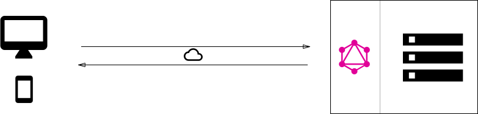

### Alexander Pihl - 4. semester - Fullstack JavaScript
### Study Group:
- [Alexander Pihl](https://github.com/AlexanderPihl)
- [Jean-Poul Leth-Møller](https://github.com/Jean-Poul)
- [Mick Larsen](https://github.com/MivleDK/)
- [Morten Rasmussen](https://github.com/Amazingh0rse)
- [Per Kringelbach](https://github.com/cph-pk)
___
# Period-3 GraphQL

## Explain shortly about GraphQL, its purpose and some of its use cases
**Answer:**

GraphQL is a query language for API’s and runtime used to fulfill queries with existing data. GraphQL makes it possible to ask for what you specifically want and nothing more. You don’t get a whole object filled with unnecessary variables that you don’t need but only the variables you specified.
GraphQL is based on types and fields and not endpoints like a rest API. GraphQL gives you all your data from one single endpoint. This eliminates over and under fetching which is a common issue with rest API’s.


GraphQL uses schema’s with typedefinition to make it possible to specify the data needed.
```JAVASCRIPT
   type Friend {
        id: ID
        firstName: String
        lastName: String
        gender: Gender
        language: String
        age: Int
        email: String
        contacts: [Contact]
    }
```
___
## Explain some of the Server Architectures that can be implemented with a GraphQL backend

**Answer:**

There are three different types of architecture.
___
## 1
- GraphQL Server with a Connected Database. 
    This architecture setup is mostly used for new projects. In this architecture setup, the GraphQL server is integrated with the database. When the client sends a query, the server reads the requested query and fetches data from the database. This process is known as resolving the query. After resolving the query, the response is returned to the client in the official GraphQL specification format.

    The client communicates with the GraphQL server by sending a query via computer/ mobile over HTTP. After receiving the query, the GraphQL server processes the request, retrieves data from the database and returns it to the client.



Key points of GraphQL Server with a Connected Database:
- This architecture setup is used for simple and new projects.
- It uses a single web server that implements GraphQL.
- This model uses resolving the query.
- In this model, the server resolves the queries and constructs responses with data that it fetches from the database.
___
## 2
- GraphQL Server integrated with the Existing System.
    This architecture model is used for companies having complicated projects which have legacy infrastructure and many different APIs. In this architecture model, GraphQL can be used to merge microservices, legacy infrastructure, and third-party APIs in the existing system and hide the complexity of data fetching logic. The server doesn't care about the database you use. It may be a relational or a NoSQL database.

    The GraphQL server acts as an interface between the client and the existing systems.


___
## 3

-  A Hybrid approach with a Connected Database and integrated Systems.
    This architecture model is a combination of the above two approaches: the GraphQL server with a connected database and the GraphQL server integrated with the existing system. In this architecture model, when a query is received by the server, the server resolves the received query and retrieves data either from the connected database or from the integrated API's.


___

We make use of the following model in our startcode:


___
## Explain what is meant by the terms over- and under-fetching in GraphQL, compared to  REST

**Answer:**

- Over-Fetching:
    - Over-Fetching happens when the response fetches more data then what is required. Consider the example of a blog home page. It displays the list of all blog posts (just the title and URLs). However, to display this list, you need to fetch all the blog posts (along with body data, images, etc.) through the API, and then show only what is required, usually through UI code. This impacts the performance of your app and consumes more data, which is expensive for the user.

- Under-Fetching:
    - Under-fetching, on the other hand, is not fetching adequate data in a single API request. In this case, you need to make additional API requests to get related or referenced data. For instance, while displaying an individual blog post, you also need to fetch the referenced author’s entry, just so that you can display the author’s name and bio.
    GraphQL handles this well. It lets you fetch all relevant data in a single query.

___
## Explain shortly about GraphQL’s type system and some of the benefits we get from this

**Answer:** 

GraphQL is a strongly typed language. Type System defines various data types that can be used in a GraphQL application. The type system helps to define the schema, which is a contract between client and server. The commonly used GraphQL data types are as follows
Scalar
Stores a single value ( field: data_type ).
Object
Shows what kind of object can be fetched.
Query
Entry point type to other specific types.
```JAVASCRIPT
    type Query {
        getFriend(id: ID): Friend
        allFriends : [Friend]!
    }
```
Mutation
Entry point for data manipulation ( post, put ).
```JAVASCRIPT
    type Mutation {
        createFriend(input: FriendInput): Friend
        updateFriend(input: FriendInput): Friend
        deleteFriend(id: ID!): String
    }
```
Enum
Useful in a situation where you need the user to pick from a prescribed list of options ( Gender ).
```JAVASCRIPT
    enum Gender {
        MALE
        FEMALE
        OTHER
    }
```
___
## Explain shortly about GraphQL Schema Definition Language, and provide examples of schemas you have defined.

**Answer:**

Schema Definition Language (SDL) is a way of defining a GraphQL schema. It consists of object types and fields. 
```JAVASCRIPT
    type Friend {
        id: ID
        firstName: String
        lastName: String
        email: String
        role: String
    }
```
```JAVASCRIPT
     type Query {
        getAllFriends : [Friend]!
        getAllFriendsProxy: [Friend]!
        getFriendByEmail(input: String): Friend
        getFriendById(input: String): Friend
    }
```
```JAVASCRIPT
    input FriendInput {
        firstName: String!
        lastName: String!
        password: String!
        email: String!
    }
```
```JAVASCRIPT
    type Mutation {
        createFriend(input: FriendInput): Friend
        updateFriend(email: String, input: FriendEditInput): Friend
        deleteFriend(id: ID!): String
    }
```
___
## Provide examples demonstrating data fetching with GraphQL. You should provide examples both running in a Sandbox/playground and examples executed in an Apollo Client

**Answer:**

Start(Remember the server starts in www.ts): 
App.ts
```JAVASCRIPT 
app.use("/graphql", (req, res, next) => {
    const body = req.body;
    if (body && body.query && body.query.includes("createFriend")) {
        console.log("Create")
        return next();
    }
    if (body && body.operationName && body.query.includes("IntrospectionQuery")) {
        return next();
    }
    if (body.query && (body.mutation || body.query)) {
        return authMiddleware(req, res, next)
    }
    next()
})

import { graphqlHTTP } from 'express-graphql';
import { schema } from './graphql/schema';

app.use('/graphql', graphqlHTTP({
    schema: schema,
    graphiql: true,
}));
```
Explain and show that we have a schema with type, query, input and mutation (look in schema.ts).

Also show our resolvers.ts where we have all our functions that will execute our request.

The resolvers and schema will be set in schema.ts with the following line:
```
const schema = makeExecutableSchema({ typeDefs, resolvers });
```
**Example with apollo client can be found in apolloClientWithLogin.**

You connect Apollo Client to React with the ApolloProvider component. The ApolloProvider is similar to React's Context.Provider. It wraps your React app and places the client in the context, which enables you to access it from anywhere in your component tree.

This also helps us with not having to pass props around all components. 

An example on the above written statement is by lookings in App.tsx where we wrap our switch with 
```JAVASCRIPT 
<ApolloProvider client={client}> ...</ApolloProvider>
```
We get a new client with the following:
```JAVASCRIPT 
client = new ApolloClient({
    link: authLink.concat(httpLink),
    cache: new InMemoryCache()
  })
```
To be able to use any of the apollo functionalities we import apollo client:
```JAVASCRIPT 
import { ApolloProvider, ApolloClient, createHttpLink, InMemoryCache } from "@apollo/client"
```


___
## Provide a number of examples demonstrating; creating, updating and deleting with Mutations. You should provide examples both running in a Sandbox/playground and examples executed in an Apollo Client.

**Answer:**

Look in apolloClientWithLogin(frontend - backend can be found in our startcode) .

[Create](https://github.com/cph-pk/4sem-Fullstack-Flow3/blob/main/Day-3/apolloClientWithLogin/src/components/AddFriend.tsx)

[Update](https://github.com/cph-pk/4sem-Fullstack-Flow3/blob/main/Day-3/apolloClientWithLogin/src/components/UpdateFriend.tsx)

[Delete](https://github.com/cph-pk/4sem-Fullstack-Flow3/blob/main/Day-3/apolloClientWithLogin/src/components/DeleteFriend.tsx) 

## Explain the Concept of a Resolver function, and provide a number of simple examples of resolvers you have implemented in a GraphQL Server.

**Answer:**

In order to respond to queries, a schema needs to have resolvers for all fields. Resolvers are per field functions that are given a parent object, arguments, and the execution context, and are responsible for returning a result for that field. Resolvers cannot be included in the GraphQL schema language, so they must be added separately. The collection of resolvers is called the "resolver map".

A resolver is a function that's responsible for populating the data for a single field in your schema. Whenever a client queries for a particular field, the resolver for that field fetches the requested data from the appropriate data source.
A resolver function returns one of the following:
Data of the type required by the resolver's corresponding schema field (string, integer, object, etc.)
A promise that fulfills with data of the required type
```JAVASCRIPt
// resolver map
export const resolvers = {
  Query: {
    getAllFriends: (root: any, _: any, req: any) => {
      if (!req.credentials || !req.credentials.role || req.credentials.role !== "admin") {
        throw new ApiError("Not Authorized", 401);
      }
      return friendFacade.getAllFriendsV2();
    },

    getAllFriendsProxy: async (root: object, _: any, context: Request) => {
      let options: any = { method: "GET" };

      //This part only required if authentication is required
      const auth = context.get("authorization");
      if (auth) {
        options.headers = { authorization: auth };
      }
      return fetch(
        `http://localhost:${process.env.PORT}/api/friends/all`,
        options
      ).then((r) => {
        if (r.status >= 400) {
          throw new Error(r.statusText);
        }
        return r.json();
      });
    },

  getFriendByEmail: (root: any, { input }: { input: string }, req: any) => {
    if (!req.credentials.role || req.credentials.role !== "admin") {
      throw new ApiError("Not Authorized", 401);
    }

    const friend = friendFacade.getFriendFromEmail(input);
    return friend;
  },

  getFriendById: (root: any, { input }: { input: string }, req: any) => {
    if (!req.credentials.role || req.credentials.role !== "admin") {
      throw new ApiError("Not Authorized", 401);
    }

    const friend = friendFacade.getFriendFromId(input);
    return friend;
  }
},
  Mutation: {
    createFriend: async (_: object, { input }: { input: IFriend }) => {
      return friendFacade.addFriendV2(input);
    },

    updateFriend: async (
      _: object,
      { email, input }: { email: string; input: IFriend }
    ) => {
      return friendFacade.editFriendV2(email, input);
    },
  
    deleteFriend: async (root: any, { id }: { id: string }) => {
      console.log("resolver: " + id);
      return friendFacade.deleteFriendV2(id);
    }
  },
};
```

## Explain the benefits we get from using a library like Apollo-client, compared to using the plain fetch-API

**Answer:**

Apollo Client takes care of the request cycle from start to finish, including tracking loading and error states for you. There's no middleware to set up or boilerplate to write before making your first request, nor do you need to worry about transforming and caching the response. All you have to do is describe the data your component needs and let Apollo Client do the heavy lifting.

With Apollo's declarative approach to data fetching, all of the logic for retrieving your data, tracking loading and error states, and updating your UI is encapsulated by the useQuery Hook.

**Example:** 
```JAVASCRIPT
(loading = when data is in transit, error = an error occurred, data = received data)

function Feed() {
  const { loading, error, data } = useQuery(GET_DOGS);
  if (error) return <Error />;
  if (loading || !data) return <Fetching />;
  return <DogList dogs={data.dogs} />;
}
```
One of the key features that sets Apollo Client apart from other data management solutions is its normalized cache. Apollo Client includes an intelligent cache out of the box, that requires very little configuration to get started with.

```JAVASCRIPT
import { ApolloClient, InMemoryCache } from '@apollo/client';
const client = new ApolloClient({
  cache: new InMemoryCache()
});
```

Apollo Client is a comprehensive state management library for JavaScript. It enables you to use GraphQL to manage both local and remote data. Apollo Client is view-layer agnostic, so you can use it with React, Vue, Angular, or even vanilla JS.


## In an Apollo-based React Component, demonstrate how to perform GraphQL Queries, including:

**Explain the purpose of ApolloClient and the ApolloProvider component**

- Apollo Client is a comprehensive state management library for JavaScript that enables you to manage both local and remote data with GraphQL. Use it to fetch, cache, and modify application data, all while automatically updating your UI.

- You connect Apollo Client to React with the ApolloProvider component. The ApolloProvider is similar to React's Context.Provider. It wraps your React app and places the client in the context, which enables you to access it from anywhere in your component tree.

**Explain the purpose of the gql-function (imported from graphql-tag)**

The gql template literal tag can be used to concisely write a GraphQL query that is parsed into a standard GraphQL AST. It is the recommended method for passing queries to Apollo Client. While it is primarily built for Apollo Client, it generates a generic GraphQL AST which can be used by any GraphQL client.


## Explain Custom Hooks used by your Client Code

**Answer:**

Can be found in FindFriend.ts in apolloClientWithLoging

[Apollo client](https://github.com/cph-pk/4sem-Fullstack-Flow3/tree/main/Day-3/apolloClientWithLogin/src/components)

Remember useLazyQuery() is used when you don’t want the query to be executed right away.
```JAVASCRIPT
 const [getFriendById, { loading, called, error, data }] = useLazyQuery<IFriendResult, IVariableInput>(
    GET_FRIEND,
    {
      fetchPolicy: "cache-and-network" 
      // fetchPolicy: "cache-first"
      //pollInterval: 1000
    }
  );
// Another example on a hook from AllFriends.tsx
useQuery<FriendData>(
    ALL_FRIENDS,
    { fetchPolicy: "cache-first" }
    //{ fetchPolicy: "cache-and-network" }
  )
```

- **Explain and demonstrate the caching features built into Apollo Client**

**Answer:**

Can be found in FindFriend.ts in apolloClientWithLoging in line 33-35.

[Apollo client](https://github.com/cph-pk/4sem-Fullstack-Flow3/tree/main/Day-3/apolloClientWithLogin/src/components)

First example in addFriends.tsx in line 48-57
Second example can be found in Login.tsx in line 45-47 (localStorage.setItem())


In an Apollo-based React Component, demonstrate how to perform GraphQL Mutations?

**Answer:**

Can be found in FindFriend.ts in apolloClientWithLoging

[Apollo client](https://github.com/cph-pk/4sem-Fullstack-Flow3/tree/main/Day-3/apolloClientWithLogin/src/components)

Simple example can be found in DeleteFriend.tsx or else look in AddFriend.tsx


Demonstrate and highlight important parts of a “complete” GraphQL-app using Express and MongoDB on the server-side, and Apollo-Client on the client.

**Answer:**

Look in the startcode and apolloClientWithLogin.

***Backend:***

Important parts is that express will be started with important middleware in app.ts. Server starts in www.ts. All endpoints can be found in FriendRoutesAuth.ts. All authentication can be found in /middleware/basic-auth. The friendFacade talks with MongoDB (we instantiate a facade with an db from FriendRoutesAuth). Also remember we can fetch the db because we attach it to the global app variable. Talk about everything related to graphql (resolvers and schema). If time allows it you can talk about custom error and logging and debugging.

***Frontend:***

App.tsx which contains everything Apollo related (ApolloProvider and ApolloClient). Login for localStorage handling together with Header.tsx. Besides that all the functions in all the components (create, update, find and delete).
